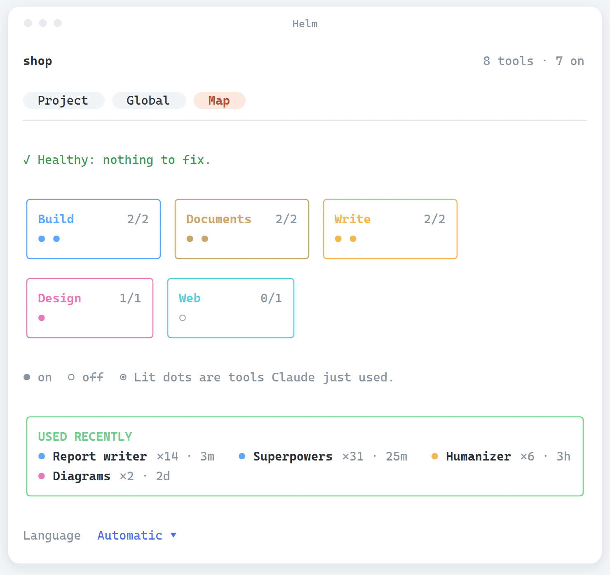

<div align="center">


**Il pannello di controllo di Claude Code.** Prepara ogni progetto con le skill giuste, mostra cosa è in uso e controlla i nuovi strumenti prima che tu li aggiunga.

[](https://github.com/rlpb/helm/actions/workflows/ci.yml)
[](LICENSE)
[](https://ko-fi.com/rlpb_)

[English](README.md) · Italiano

</div>

Ogni settimana escono nuovi plugin, skill e strumenti. Helm è il posto in Claude Code dove li vedi tutti, scegli quelli che servono a un progetto e ne controlli uno nuovo prima che entri.

## Cosa fa

- **Prepara un progetto.** Apri una cartella nuova e Helm chiede cosa stai costruendo. Propone gli strumenti adatti tra quelli già installati, e un solo tasto li accende solo per quella cartella. Annulla rimette la cartella esattamente com'era.
- **Controlla uno strumento.** Incolla un link GitHub, `owner/nome` o solo un nome. Helm legge il repository (licenza, se è archiviato, ultimo aggiornamento, stelle, e se contiene un plugin o una skill), dà un verdetto in parole semplici e installa solo dopo il tuo sì. Uno strumento aggiunto per un progetto viene poi proposto per tutti.
- **Vedi cosa è in uso.** La scheda **Map** mostra tutto ciò che è installato come una scheda per categoria con un punto per strumento. Quando Claude usa una skill, il suo punto si accende, e sotto compaiono gli strumenti usati più di recente. Non costa token.
- **Tieni i limiti sott'occhio.** Una riga discreta sopra il prompt mostra i limiti delle 5 ore e della settimana e il contesto come piccole barre, più la skill che Claude sta usando, con un puntino di sicurezza e il tasto **Open Helm**. I valori seguono la sessione mentre lavora.
- **Parla la tua lingua.** 16 lingue, di default quella del computer, cambiabile dal pannello.
- **Controlla prima di fidarti.** [SkillSpector](https://github.com/NVIDIA/SkillSpector) di NVIDIA scansiona ogni skill e plugin che hai, e ogni strumento nuovo prima che si possa installare, cercando prompt injection, furto di dati e codice rischioso. Se la scansione dice "non installare", il tasto Installa sparisce. È solo analisi statica: nessun modello, nessuna chiave, niente esce dal computer. Helm lo tiene aggiornato.
- **Tienila in salute.** La sezione **Stato** della scheda Globale controlla plugin con i file spariti, cartelle di skill rotte, skill senza descrizione e nomi doppi (da sola all'avvio e dopo ogni correzione), aggiorna tutti i plugin con un tasto e cerca skill rischiose. Togliere un plugin funziona qualunque sia lo scope in cui è installato. Niente di questo tocca le impostazioni di un progetto. Sotto, ogni strumento e skill è raccolto per categoria: premi un nome per vedere cos'è e cosa fa.
- **Avvia bene un repository.** Se è disponibile un connettore GitHub, una casella aggiunge al tuo primo prompt una base professionale per GitHub: scegli la licenza e le voci che vuoi (README, CI, `SECURITY.md`, Dependabot, protezione del ramo e altro), aggiungi le tue indicazioni, e resta memorizzato.

<div align="center">

</div>

<div align="center">

</div>

## Installazione

Serve Claude Code **2.1.289 o successivo**.

```text
/plugin marketplace add rlpb/helm
/plugin install helm@helm
```

Poi scrivi `/helm`. In una cartella che Helm non conosce compare anche un avviso sopra il prompt: **Open** o **Not here** (ricordato per cartella). In una chat già avviata propone invece di leggere la cartella e suggerire gli strumenti.

## Come resta sicuro

- Esegue solo comandi `gh`, `claude plugin …`, `skillspector` e `uv tool …`, costruiti da nomi semplici, e non installa nulla senza un sì.
- La configurazione di un progetto va nel file `.claude/settings.local.json` di quella cartella, mai nelle impostazioni globali. Annulla ripristina i valori precedenti chiave per chiave.
- Il controllo di salute legge soltanto. L'unica correzione, togliere un plugin con i file spariti, richiede una seconda pressione; se il comando non riesce, Helm modifica da sé il registro dei plugin dopo averne salvato una copia accanto (`installed_plugins.json.helm-backup`).
- Helm non fa chiamate di rete proprie.

Vedi [SECURITY.md](SECURITY.md) per segnalare un problema e verificare un download.

## Verificare un download

Le release sono costruite dal workflow di release a partire da un commit con tag, con checksum SHA-256 e attestazione di provenienza:

```bash
sha256sum -c SHA256SUMS.txt
gh attestation verify helm-0.10.1.zip --repo rlpb/helm
```

## Supporto

Helm è gratuito, con licenza Apache 2.0. Niente è a pagamento e niente lo sarà. Se ti fa risparmiare tempo, un caffè aiuta a mandarlo avanti.

<div align="center">
<a href="https://ko-fi.com/rlpb_"></a>
</div>

## Licenza

Apache License 2.0. Riusalo, modificalo e distribuiscilo, anche a scopo commerciale; conserva la licenza e il file [NOTICE](NOTICE) e indica cosa hai cambiato. Vedi [CONTRIBUTING.md](CONTRIBUTING.md) per aiutare.
