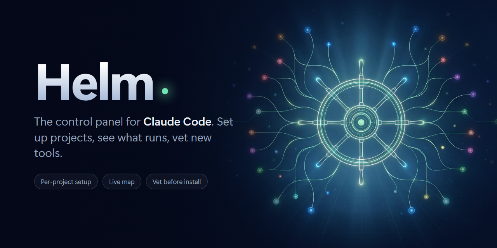
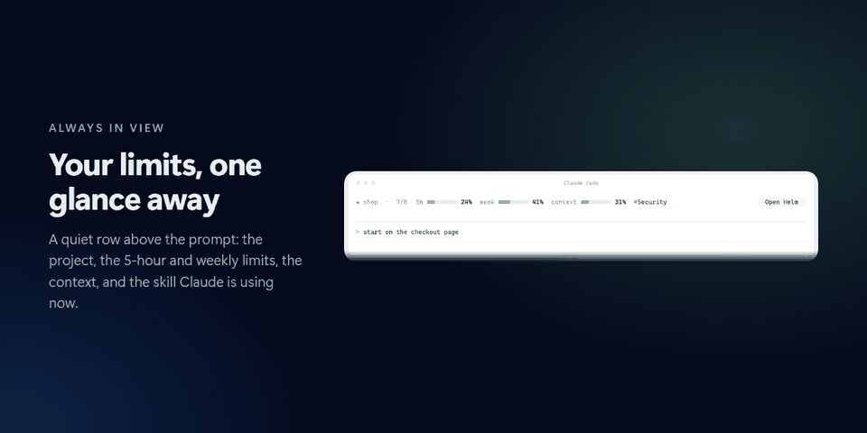

<div align="center">



**The control panel for Claude Code.** It sets up each project with the right skills, shows what is in use, and vets new tools before you add them.

[](https://github.com/rlpb/helm/actions/workflows/ci.yml)
[](LICENSE)
[](https://ko-fi.com/rlpb_)

English · [Italiano](README.it.md)

</div>

New plugins, skills and tools appear every week. Helm is the one place in Claude Code where you see all of them, pick the ones a project needs, and check a new one before it goes in.

## What it does

- **Set up a project.** Open a new folder and Helm asks what you are building. It shortlists the fitting tools from what you already have installed, and one press turns them on for that folder only. Undo puts the folder back exactly as it was.
- **Vet a tool.** Paste a GitHub link, `owner/name` or just a name. Helm reads the repository (license, archived or not, last update, stars, and whether it holds a plugin or a skill), gives a plain verdict, and installs only after you say yes. A tool you added for one project is offered later for all of them.
- **See what is in use.** The **Map** tab shows everything installed as one card per category with a dot per tool. When Claude uses a skill, its dot lights up, and the tools used most recently are listed below. It costs no tokens.
- **Keep your limits in view.** A quiet row above the prompt shows the 5-hour and weekly limits and the context as small bars, plus the skill Claude is using now, with an **Open Helm** button.
- **Speaks your language.** 16 languages, following the computer's by default, changeable from the panel.
- **Check before you trust.** [SkillSpector](https://github.com/NVIDIA/SkillSpector) by NVIDIA scans every skill and plugin you have, and every new tool before it can be installed, for prompt injection, data theft and risky code. A scan that says "do not install" hides the Install button. It is static-only: no model, no key, nothing leaves your computer. Helm keeps it up to date.
- **Keep it healthy.** *Tidy up* finds plugins whose files are gone, broken skill folders, skills with no description and duplicate names. *Update all* updates every plugin in one press. Neither touches a project's own settings.
- **Start a repository properly.** When a GitHub connector is available, one checkbox adds a professional GitHub baseline to your first prompt: pick a license and the items you want (README, CI, `SECURITY.md`, Dependabot, branch protection and more), add your own directions, and it is remembered.

<div align="center">

</div>

<div align="center">

</div>

## Install

You need Claude Code **2.1.289 or newer**.

```text
/plugin marketplace add rlpb/helm
/plugin install helm@helm
```

Then type `/helm`. In a folder Helm has not seen, a notice also appears above the prompt: **Open** or **Not here** (remembered per folder).

## How it stays safe

- It runs only `gh` and `claude plugin …` commands, built from plain names, and installs nothing without a yes.
- A project's setup is written to that folder's own `.claude/settings.local.json`, never to your global settings. Undo restores the previous values key by key.
- *Tidy up* only reads. Its one fix, removing a plugin whose files are gone, needs a second press.
- Helm makes no network call of its own.

See [SECURITY.md](SECURITY.md) for how to report a problem and how to verify a download.

## Verify a download

Releases are built by the release workflow from a tagged commit, with a SHA-256 checksum and a build-provenance attestation:

```bash
sha256sum -c SHA256SUMS.txt
gh attestation verify helm-0.10.0.zip --repo rlpb/helm
```

## Support

Helm is free, under the Apache 2.0 license. Nothing in it is paid, and nothing will be. If it saves you time, a coffee helps keep it going.

<div align="center">
<a href="https://ko-fi.com/rlpb_"></a>
</div>

## License

Apache License 2.0. Reuse it, change it and ship it, including commercially; keep the license and the [NOTICE](NOTICE) with it and say what you changed. See [CONTRIBUTING.md](CONTRIBUTING.md) to help out.
